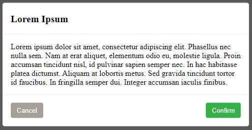

# dialog4react

Dialog modal for React, that can queue messages.


## Installation

Using [npm](https://github.com/npm/cli):

```
npm install dialog4react --save
```

Or using [yarn](https://github.com/yarnpkg/yarn):

```
yarn add dialog4react
```

## Quick Example

You'll need to render DialogComponent somewhere in your project. You need only one DialogComponent in your entire project. Messages can be queued from anywhere within your project. For example:

```js
import React, { Component } from 'react';
import { DarkDialogComponent as DialogComponent } from 'dialog4react';
import MyCoolWebsite from './MyCoolWebsite';

export default class App extends Component {
    render() {
        return (
            <React.Fragment>
                <MyCoolWebsite />
                <DialogComponent />
            </React.Fragment>
        );
    }
}
```


```js
import React, { Component } from 'react';
import Dialog from 'dialog4react';

export default class MyCoolWebsite extends Component {
    onClickButton = () => {
        Dialog.add({
            title: 'Lorem Ipsum',
            body: 'Lorem ipsum dolor sit amet, consectetur adipiscing elit. Phasellus nec nulla sem.',
            showCancel: true
        });
    };

    render() {
        return (
            <div>
                <h1>hello world</h1>
                <button onClick={this.onClickButton}>test</button>
            </div>
        );
    }
}
```

## Messages

From anywhere within your project you can enqueue as many messages as you need using `Dialog.add(message)` method. `DialogComponent` will render them one at a time, until all of them are dismissed. The structure of a `message` object looks like this:

```ts
export type Message = {
    title?: string, // title of the message
    body?: string, // body of the message
    showCancel?: boolean, // should cancel button be visible
    onClickCancel?: CallbackFunction, // executed when cancel button is clicked
    onClickConfirm?: CallbackFunction, // executed when confirm button is clicked
    cancelText?: string, // override text inside cancel button
    confirmText?: string, // override text inside confirm button
};
export type CallbackFunction = (message: Message) => void;
```

By default `DialogComponent` will use string `Cancel` for cancel button and `Confirm` for confirm button. You can change this per message using `cancelText` and `confirmText` fields of `message` object.

```js
Dialog.add({
    title: "Hello",
    body: "Would you like some tea?",
    showCancel: true,
    cancelText: "No",
    confirmText: "Yes"
});
```

You can also change those default values globally with props on `DialogComponent`.

```js
<DialogComponent
    buttonCancelText={"No"}
    buttonConfirmText={"Yes"}
/>
```

Please note that all fields of a `message` are optional, therefore you can show messages without `title` or without `body`. By default cancel button is not visible, so you need to pass `showCancel:true` in order to display it. Confirm button is always visible. In theory you could execute `Dialog.add({});` to display a modal that contains only `Confirm` button and no information at all.. but that would be stupid.

Most important are in my opinion `CallbackFunction`s. Those are fired based on their corresponding button clicks. Example usage:

```js
Dialog.add({
    title: "Cookie Consent",
    body: "Hello dude, due to some wierd law we need you to allow us usage of cookies.",
    showCancel: true,
    cancelText: "Leave site",
    confirmText: "Allow all cookies",
    onClickCancel: () => {
        window.location = "https://www.google.com/";
    },
    onClickConfirm: () => {
        const setCookie = (name, value, days) => {
            // https://stackoverflow.com/questions/14573223/set-cookie-and-get-cookie-with-javascript
            let expires = "";
            if (days) {
                let date = new Date();
                date.setTime(date.getTime() + (days*24*60*60*1000));
                expires = "; expires=" + date.toUTCString();
            }
            document.cookie = name + "=" + (value || "")  + expires + "; path=/";
        }
        setCookie("cookie-consent", "isn't it ironic to store cookie consent in a cookie", 365);
    }
});
```


One last thing.. `message` object is given back to `CallbackFunction`s in case you need to attach your own data to it. This can be useful if you want to have one big callback function with `switch` or something like that:

```js
const sharedCallback = (message) => {
    switch(message.myCustomId) {
        default:
            crashWebsite();
            break;
        case 1234:
            crashMySmartFridge();
            break;
        case 5678:
            feedMyCat();
            break;
    }
};
Dialog.add({
    title: "Message 1",
    onClickConfirm: sharedCallback,
    myCustomId: 1234,
});
Dialog.add({
    title: "Message 2",
    onClickConfirm: sharedCallback,
    myCustomId: 5678,
});
```

## Built-in styles

You can use built-in styles by importing different version of DialogComponent.

Dark style:

```js
import { DarkDialogComponent as DialogComponent } from 'dialog4react';
```


Light style:

```js
import { LightDialogComponent as DialogComponent } from 'dialog4react';
```




## Custom styles

Regular `DialogComponent` comes with no built-in css. That is perfect for creating your own style.

```js
import { DialogComponent } from 'dialog4react';
```
 HTML structure of `DialogComponent` looks like this:


You can change `className`s using the following props:

```js
<DialogComponent
    overlayClassName={"dialog4react-overlay"}
    containerClassName={"dialog4react-container"}
    titleClassName={"dialog4react-title"}
    bodyClassName={"dialog4react-body"}
    buttonContainerClassName={"dialog4react-button-container"}
    buttonConfirmClassName={"dialog4react-confirm"}
    buttonCancelClassName={"dialog4react-cancel"}
/>
```

If you need something to start with, you can copy the following css. It comes from `DarkDialogComponent`.

```css
.dialog4react-overlay {
    position: absolute;
    top: 0;
    left: 0;
    right: 0;
    bottom: 0;
    background-color: rgba(0,0,0,0.65);
    z-index: 2147483647;
}
.dialog4react-container {
    max-width: 500px;
    width: fit-content;
    margin: 0 auto;
    position: relative;
    top: 50%;
    transform: translateY(-50%);
    background-color: #2e3538;
    color: #dadada;
    border: 1px solid #171a1c;
    border-radius: 0.3rem;
}
.dialog4react-title {
    margin: 0;
    text-align: left;
    padding: 1rem;
    border-bottom: 1px solid #171a1c;
    font-size: 1.25rem;
    line-height: 1.5;
}
.dialog4react-body {
    padding: 1rem;
    margin: 0;
}
.dialog4react-button-container {
    display: flex;
    align-items: center;
    justify-content: space-between;
    padding: 0.75rem;
    border-top: 1px solid #171a1c;
}
button.dialog4react-confirm, button.dialog4react-cancel {
    border-radius: 0;
    outline: 0;
    border: none;
    cursor: pointer;
    margin: 0.25rem;
    padding: 0.375rem 0.75rem;
    border-radius: 0.25rem;
    transition: background-color 0.2s ease-in-out;
    text-align: center;
    vertical-align: middle;
    line-height: 1.5;
    color: #ffffff;
}
button.dialog4react-confirm:only-child {
    margin-left: auto;
}
button.dialog4react-confirm {
    background-color: #2a8938;
}
button.dialog4react-confirm:hover {
    background-color: #309c40;
}
button.dialog4react-cancel {
    background-color: #454c54;
}
button.dialog4react-cancel:hover {
    background-color: #505962;
}
```
